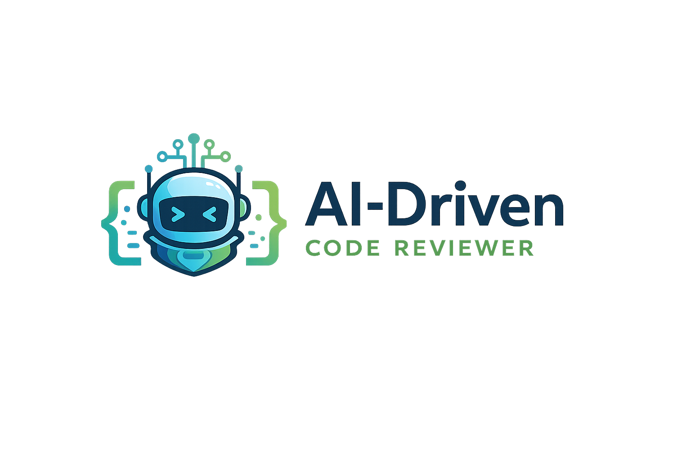

# 🤖 AI-Powered Code Reviewer



> **An intelligent web application that reviews Python code, detects issues, and suggests improvements using AI.**  
> Developed as part of the **Infosys Springboard Virtual Internship Program**.

---

## 📌 Project Overview

**AI-Powered Code Reviewer** is a web-based application that helps developers and students improve their Python code quality.  
It automates the code review process by combining **static code analysis** with **AI-powered recommendations**.

The system analyzes user-submitted Python code, detects errors, checks PEP-8 style compliance, and provides intelligent suggestions using a **Large Language Model (LLM)**.

This tool is especially useful for:
- Beginners learning Python
- Students working on assignments
- Developers looking for quick code reviews
- Educators demonstrating clean coding practices

---

## 🌍 Live Application

🚀 Try the deployed application here:  
👉 **https://ai-driven-code-reviewer-saswata-sarkar.streamlit.app/**

---

## ✨ Key Features

### 🔎 Static Code Analysis
- Parses Python code using **Abstract Syntax Trees (AST)**
- Validates code structure before deeper analysis

### 🐞 Error Detection
- Identifies syntax errors
- Detects common logical mistakes
- Provides clear explanations and fixes

### 🎯 PEP-8 Style Checking
- Enforces Python coding standards
- Displays corrected, formatted code
- Improves readability and maintainability

### 🧠 AI-Powered Suggestions
- Uses **Qwen 2.5 (7B Instruct)** LLM via Hugging Face
- Provides meaningful, non-generic feedback
- Suggests optimizations and best practices

### 💬 Interactive AI Review
- AI responses displayed in a chat-style interface
- Streaming output for better user experience

### 📊 AST-Based Architecture
- Backend logic built around AST parsing
- Ensures safe and reliable static analysis before AI inference

---


## 🧰 Technology Stack

### 🖥️ Frontend
- **Streamlit** – interactive UI and deployment

### ⚙️ Backend & Analysis
- **Python 3.11**
- **AST (Abstract Syntax Tree)** for parsing
- **Custom static analyzers** for errors and style checks

### 🧠 Artificial Intelligence
- **Model**: Qwen/Qwen2.5-7B-Instruct  
- **Platform**: Hugging Face Inference API  
- **Integration**: LangChain (HuggingFaceEndpoint)

### 🔐 Deployment & DevOps
- **Streamlit Cloud**
- **Git & GitHub** for version control
- Secure API key handling using `st.secrets`

---
## 📁 Repository Structure

```text
AI-Driven-Code-Reviewer/
├── ab.py                  # Streamlit application entry point
├── ai_suggester.py         # AI / LLM integration module
├── code_parser.py          # AST parsing utilities
├── error_detector.py       # Static error detection logic
├── style_checker.py        # PEP-8 style checking module
├── chatbot.py              # AI chat utilities
├── requirements.txt        # Project dependencies
├── logo.png                # Application logo
└── README.md               # Project documentation
---

## 🏗️ System Architecture

```text
User Code Input
        │
        ▼
AST Parser (code_parser.py)
        │
        ▼
Static Error Detector (error_detector.py)
        │
        ▼
Style Checker (style_checker.py)
        │
        ▼
AI Suggestion Engine (ai_suggester.py)
        │
        ▼
Streamlit UI (ab.py)

--
